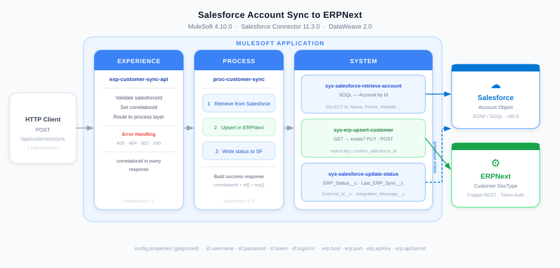

# Salesforce to ERPNext Customer Sync — MuleSoft

## Overview
A MuleSoft integration that syncs customer (Account) data from Salesforce to ERPNext. When triggered via HTTP, MuleSoft retrieves the full Account record from Salesforce, upserts the customer in ERPNext, and writes the sync status back to the Salesforce Account.

## Architecture



## Tech Stack
- Mule Runtime 4.10.0
- DataWeave 2.0
- Salesforce Connector 11.3.0
- HTTP Connector 1.11.1
- ERPNext (Frappe REST API)
- Maven

## Project Structure
```
├── src/main/mule/
│   └── customer-sync.xml                   # All flows (exp, proc, sys layers)
├── src/main/resources/
│   ├── config.properties                   # Local config (gitignored)
│   ├── config-local.properties.template    # Config template
│   └── log4j2.xml                          # Logging config
├── sample-data/                            # Sample request/response payloads
├── screenshots/                            # Flow and test screenshots
├── docs/                                   # Architecture diagram
├── pom.xml
└── mule-artifact.json
```

## Prerequisites
- Anypoint Studio (with Mule 4.10.0 runtime)
- Java 17
- Salesforce Developer Org with custom fields on Account:
  - `ERP_Status__c`
  - `Last_ERP_Sync__c`
  - `Integration_Message__c`
  - `External_Id__c`
- ERPNext instance with:
  - Custom field on Customer DocType: `custom_salesforce_id`
  - API token (key + secret)
- Postman or curl for testing

## Configuration
Copy `config-local.properties.template` to `config.properties` and fill in your values:

```properties
http.host=0.0.0.0
http.port=8081
api.basePath=/api

erp.host=<your-erpnext-host>
erp.port=<port>
erp.apiKey=<api-key>
erp.apiSecret=<api-secret>

sf.username=<salesforce-username>
sf.password=<salesforce-password>
sf.token=<security-token>
sf.loginUrl=https://login.salesforce.com/services/Soap/u/60.0
```

Never commit `config.properties` — it is gitignored.

## How to Run
1. Import project into Anypoint Studio (File → Import → Anypoint Studio Project)
2. Add `config.properties` under `src/main/resources/`
3. Run as Mule Application
4. Test with Postman or curl

## API

### Sync Customer
`POST /api/customers/sync`

**Request**
```json
{ "salesforceId": "001ak00002j5UxDAAU" }
```

**Success Response (200)**
```json
{
  "correlationId": "3a7f2c1d-...",
  "status": "SUCCESS",
  "salesforce": {
    "id": "001ak00002j5UxDAAU",
    "name": "Initech LLC"
  },
  "erp": {
    "erpId": "Initech LLC",
    "customerName": "Initech LLC",
    "customerGroup": "Commercial",
    "territory": "United States",
    "salesforceId": "001ak00002j5UxDAAU",
    "modified": "2026-06-04 12:30:00.000000"
  }
}
```

**Error Responses**
| Status | errorType | Cause |
|--------|-----------|-------|
| 400 | `VALIDATION` | `salesforceId` missing or empty body |
| 404 | `NOT_FOUND` | Account not found in Salesforce |
| 502 | `ERP_CALL_FAILED` | ERPNext request failed |
| 500 | `SYSTEM` | Unexpected error |

## Sample Data
See `sample-data/` for example payloads:

| File | Description |
|------|-------------|
| `customers-sync-request.json` | Request body sent to `POST /api/customers/sync` |
| `customers-sync-response-success.json` | 200 success response |
| `customers-sync-response-400.json` | 400 — missing salesforceId |
| `customers-sync-response-404.json` | 404 — Salesforce Account not found |
| `customers-sync-response-502.json` | 502 — ERPNext call failed |
| `erp-customer-get-response.json` | ERPNext GET lookup response |
| `erp-customer-create-request.json` | Body sent to ERPNext on POST |
| `erp-customer-create-response.json` | ERPNext response on create/update |

## Screenshots
See `screenshots/` for flow and test screenshots.
